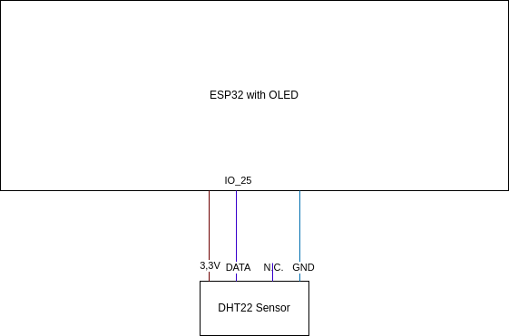
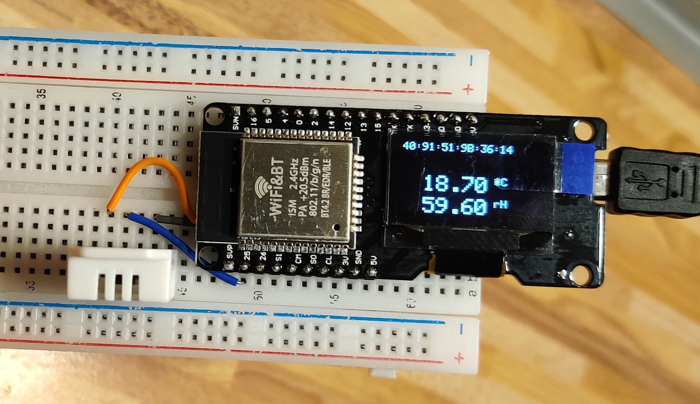
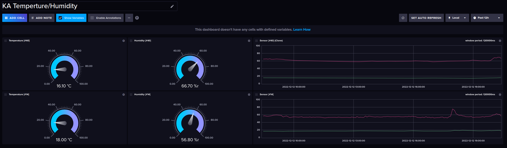

# Temperature & Humidity Logger

Written for ESP32 with OLED Display (onBoard)

---

## Features
- Creates AP on first connect (to config Wi-Fi)
- Measures:
  - Temperature
  - Humidity
- Display values in OLED
- Connected to Wi-Fi
  - Uploads data into influxDB

## Database

- Unique identifier is the **MAC-Address** of the device which is also shown on the display.

## Wiring

## Examples
### Controller

### Influx-Cloud Dashboard

---

## Setup

... for easy setup use VSCode/CLion with platform.io plugin

1. Clone this repo
2. `cd` into the repo
3. Config DB
   1. `cp ./src/secrets.h.sample ./src/secrets.h`
   2. edit the file `./src/secrets.h` to match your mongo-db-cluster-config
4. Build solution
5. Flash the Device
6. Configure Wi-Fi using the AP called: `TempHumMeter`
7. Device is ready and will start writing data to the InfluxDB (5min)

## Dev

- monitor: `pio device monitor`
