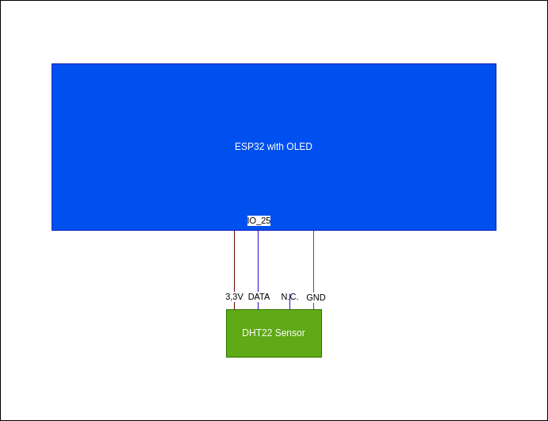

# Temperature & Humidity Logger

Written for ESP32 with OLED Display (onBoard)

---

## Features

- Measures:
  - Temperature
  - Humidity
- Display values in OLED
- Connected to Wi-Fi
  - Uploads data into influxDB

---

## Database

- Unique identifier is the MAC-Address of the device which is also shown on the display.

---

## Wiring

---

## Setup

1. Download this repo
2. `cd` into the repo
3. (optional DB)
   1. `cp ./src/secrets.h.sample ./src/secrets.h`
   2. edit the file `./src/secrets.h` to match your mongo-db-cluster-config
4. Flash the Device
5. Configure Wi-Fi using the AP called: `TempHumMeter`
6. Device is ready to go and will start writing data to the InfluxDB

## Dev

- monitor: `pio device monitor`
